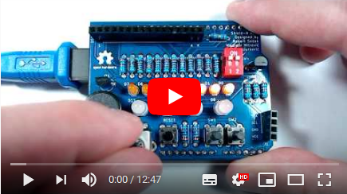

Introduction
============

Shield-A is Arduino Uno based shield for student education compatible with BASCOM-AVR(C) and Arduino IDE.
During programming please keep in mind next design rules:
- D0-D7 — LEDs can be used only if D12 is set to OUTPUT HIGH state
- LCD 1602 — can be used only if A3 is set to OUTPUT HIGH state
- RGB LED — are connected in matrix (D5-D7 - colors; D8-D11 - LEDs)
- D12 — enables D0-D7 LEDs
- D13 — reserved for buzzer
- A0 — reserved for potentiometer
- A1,A2 — reserved for switch in INPUT_PULLUP mode
- A3 — enables LCD 1602 back-light
- A4,A5 — reserved for I2C communication with on board pull-up resistors

Contributors
------------
- Petar Jurković — an initial idea for the educational shield with a list of features, QA test.
- Vladimir Mitrović — features, BASCOM-AVR expertise, schematic design
- Robert Sedak — features, Arduino expertise, schematic design, CAD design. 

Application
-----------
Robert Sedak made a video with examples programmed in Arduino IDE:

You can download examples from [here](examples/). 
Examples which name ends with '_R' are solution with register maniputalion.

Bill Of Materials
-----------------
- 1 ea., PCB from [PCBway.com](https://www.pcbway.com/project/shareproject/Shield_A_for_Arduino_Uno.html)
- 9 ea., 1K ohm 1/4W 1% Resistor (R1-R8, R13)
- 2 ea., 100 ohm 1/4W 1% Resistor (R9, R10)
- 2 ea., 560 ohm 1/4W 1% Resistor (R11-R12)
- 4 ea., 10K ohm 1/4W 1% Resistor (R14, R15, R17, R18)
- 2 ea., 18.2 ohm 1/4W 1% Resistor (R16)
- 8 ea., LED 3mm (D0-D7)
- 4 ea., RGB LED 5mm common Katode (D8-D11)
- 1 ea., 14x7.5mm passive electronic piezoelectric buzzer SE
- 2 ea., MOSFET BS170
- 1 ea., 3386-P 10K potentiometer with knob
- 1 ea., RV09 10K potentiometer - long shaft
- 1 ea., 2.54mm pitch slide DIP switch 2-bit
- 1 ea., 6x6x4.3mm SPST Momentary push switch
- 2 ea., 6x6x10mm SPST Momentary push switch
- 1 ea., 1x16Pin 2.54mm Straight Pin Header - Black
- 1 ea., 1x10Pin 2.54mm Straight Pin Header - Black
- 2 ea., 1x8Pin 2.54mm Straight Pin Header - Black
- 1 ea., 1x6Pin 2.54mm Straight Pin Header - Black
- 1 ea., 1x4 pin 2.54mm Socket Connector
- 1 ea., 1x16 pin 2.54mm Socket Connector
- 1 ea., LCD 1602 HD44780 (pin 15 is anode, pin 16 is katode)

Design Files
------------
This project is designed using Open Source [KiCad](http://kicad-pcb.org/). Design files are located in the [design_files](design_files/) folder.  You can see the [schematic](images/shield-a_schematic.png).

Gerber files
------------
You can download gerber files from [here](gerber/shield_a_v1.1.zip).

Firmware
--------
This project can be programmed using the Open Source [Arduino](https://www.arduino.cc/) and [BASCOM-AVR(C)](https://www.mcselec.com/index.php?option=com_content&task=view&id=14&Itemid=103).
Arduino examples are located in [examples](examples/) folder.

Assembly Instructions
---------------------
TBD

License
-------
[Attribution-ShareAlike 4.0 International (CC BY-SA 4.0)](https://creativecommons.org/licenses/by-sa/4.0/)

You are free to:
- Share — copy and redistribute the material in any medium or format
- Adapt — remix, transform, and build upon the material

This license is acceptable for Free Cultural Works.
- The licensor cannot revoke these freedoms as long as you follow the license terms.

Under the following terms:
- Attribution — You must give appropriate credit, provide a link to the license, and indicate if changes were made. You may do so in any reasonable manner, but not in any way that suggests the licensor endorses you or your use.
- ShareAlike — If you remix, transform, or build upon the material, you must distribute your contributions under the same license as the original.

No additional restrictions — You may not apply legal terms or technological measures that legally restrict others from doing anything the license permits.

Reference Designs ARE PROVIDED "AS IS" AND "WITH ALL FAULTS". Authors DISCLAIMS ALL OTHER WARRANTIES, EXPRESS OR IMPLIED, REGARDING PRODUCTS, INCLUDING BUT NOT LIMITED TO, ANY IMPLIED WARRANTIES OF MERCHANTABILITY OR FITNESS FOR A PARTICULAR PURPOSE.
Authors may make changes to specifications and product descriptions at any time, without notice. The Customer must notrely on the absence or characteristics of any features or instructions marked "reserved" or "undefined." 
Authors reservesthese for future definition and shall have no responsibility whatsoever for conflicts or incompatibilities arising from future changes to them. The product information on the Web Site or Materials is subject to change without notice. Do not finalize a design with this info.

